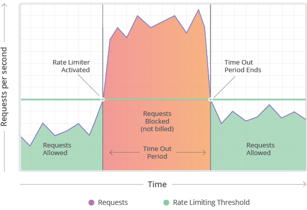

# Rate Limiting in Distributed Systems

# Introduction

Rate limiting refers to preventing the frequency of an operation from exceeding a defined limit. 
- In large-scale systems, rate limiting is commonly used to protect underlying services and resources. 
- Rate limiting is generally used as a defensive mechanism in distributed systems, so that shared resources can maintain availability.

# Distributed Rate limiter implementation for an API
- Rate limit can be implemented using Redis ( to solve inconsistency problem )
- Redis would have count of requests

## How would it work?
- When a request is made, a new temporary record is stored in Redis. This record is defined by the IP address of the request and will expire.
- If a second request is made before the first expires, the record count is incremented.
- For each request made within the rate limit window, the record is incremented.
- If the record count reaches the max limit before expiring, then a 429 error status is returned.

## Two Main Issues

### Inconsistency
- Using the consistent data store ( like Redis, Cassandra ), we can solve inconsistency problem of current rate limiting in distributed systems.
- This would add a little of latency.

### Race Conditions
- To solve the race condition while updating the counter in Redis, we would have to apply locks on the read-write operation.
- This would make the counter update as atomic in Redis.
- But this comes at a performance cost ( as latency would increase ).

## References
- https://medium.com/geekculture/system-design-basics-rate-limiter-351c09a57d14
- https://github.com/jwerre/rate-limit-redis
- https://akshay-iyangar.github.io/system-design/grokking-system-design/system-design-problems/api-rate-limiter.html
