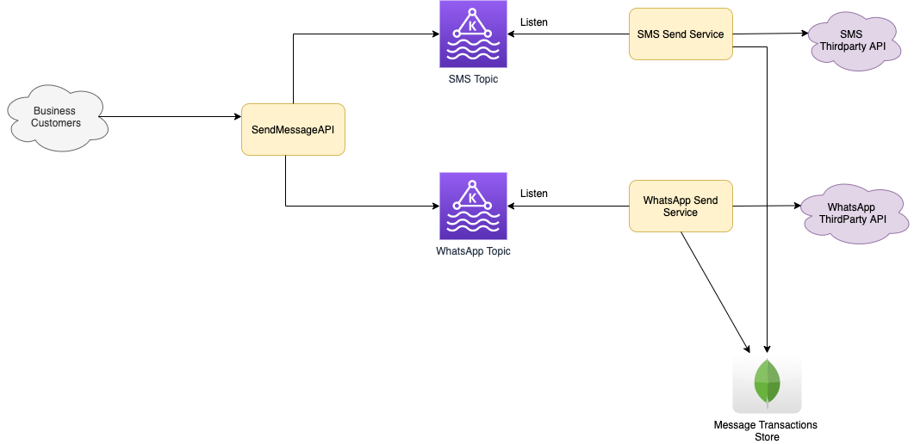

# Introduction
- Design Twillo API - Message platform for business.
- Different plans - Basic, Paid etc.

## Requirements - Basic Plan
- 1000 free messages
- X amount per whatsapp
- Y amount per sms
- 1000 transactions limit per second per team

# Tech Specs
- [Kafka](../DesignComponents/Kafka) can be used to store & process the messages
- 2 different topics ( in Kafka ) for SMS, WhatsApp message types etc.
- [Estimation](../DesignComponents/Kafka)

# DB Design
## Plan
    - Label - Basic, Pro, Business
        - FreeMessages
        - SMS
        - WhatsApp
## Teams
    - id_team
    - name
    - 
## Teams_Active_Plan
    - id_team
    - current_plan
    - start_date
    - end_date
    - updated_at
    - created_at
    - current_free_count => 0
## Teams_Historical_Data
    - History
## Transactions
    - id_team
    - Timestamp
    - Message Type
    - Billing Amount
    
# References
- https://www.youtube.com/watch?v=0q0UF6Nd7ro
